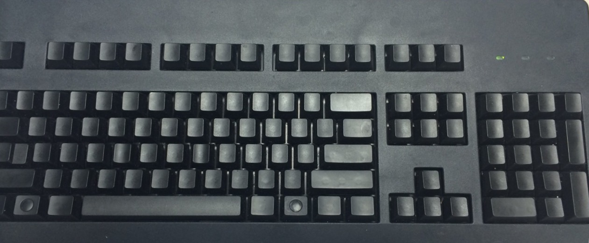
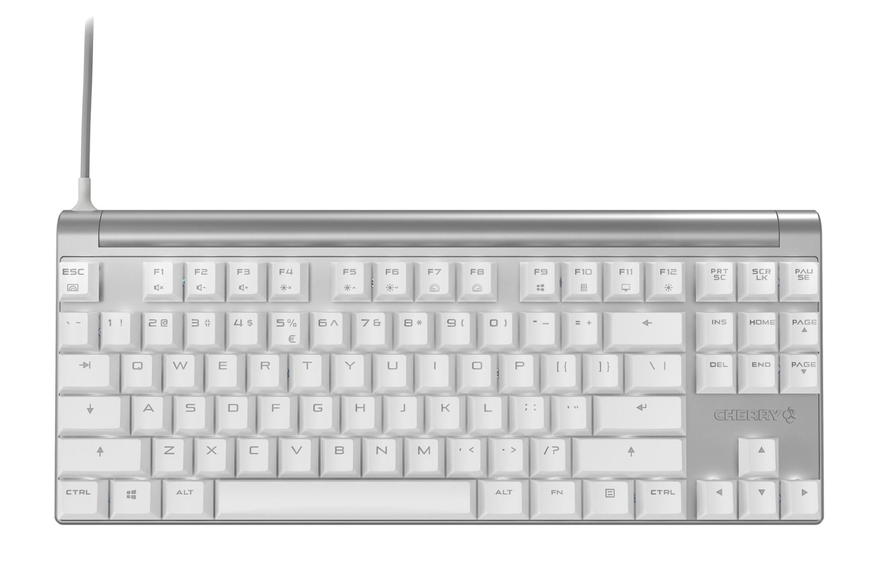

### 介绍一下你自己和所做的工作

我是 Bill，一名加拿大程序员，在一家教育公司做软件工程师。热衷于技术和各种科技、数码产品。

### 你都在使用哪些硬件？

- [Macbook Pro](http://www.apple.com/cn/macbook-pro/)

  13 寸 Macbook pro 是我的主力机，是 2013 Late 的版本。公司还发给我一台最新15寸的Macbook pro所以我一般用公司的

- iPhone X

  这台 iPhone X 是我在刚出的时候买的,除了充电时有发热问题外还是一部非常好用的手机

- [三星 32 寸 LU32J590UQNXZA 4k 显示器](https://www.bestbuy.ca/en-ca/product/samsung-32-4k-60hz-4ms-gtg-va-led-freesync-gaming-monitor-lu32j590uqnxza-black/12551080.aspx)

  性价比较高的4k显示器，过年的时候打折买的替换了我原来2 7寸 的benq显示屏。4k看着确实清晰

- 键盘

  我有两个键盘,一个是cherry无印黑轴在家用来写代码和打游戏.

  一个是从国内买的cherryMX8.0红轴在公司用来专门写代码. 红轴还是比较轻的手感所以打字起来没有那么累

- 耳机

  以前买过不少的耳机,现在基本上就用俩了. 一个是airpods一般用在出门,至今没出现过任何问题. 还一个grado lab的 sr80e 开放式耳机,虽然外表看着很cheap但是open back的音质超级好而且待时间长耳朵也不会疼. 一般在公司用来听音乐

- [Apple watch serise 2](https://www.apple.com/ca/watch/)

  刚出第二代的时候买的serise 2, 后来发现其实我自己不是很喜欢在手上戴东西所以近一年戴的很少了. 可以用来记录游泳确实很好.

### 软件

- [Sublime Text 3](http://www.sublimetext.com/) 曾经主力的 Editor目前主要用来快速浏览代码和开发个人project
- [VScode](https://vscode.com/) 前段时间上班一直在用的编辑器,以后可能想换成IDE
- [Webstorm](https://www.jetbrains.com/webstorm/) 刚换的IDE,代码跳转比vscode要好很多.打算开始使用
- [iTerm](https://www.iterm2.com/) Mac 上最好用的 Terminal Emulator
- [Monokai Pro](https://www.monokai.pro/) 免费好看的代码颜色theme, 来自大名鼎鼎的Monokai作者
- [Pocket](http://getpocket.com/) 我最喜欢的 Read it later APP
- [Typora](https://typora.io/) Markdown 写作利器
- [Sportify](https://www.spotify.com/ca-en/) 听歌的首选, 跨平台
- [Spark](https://sparkmailapp.com/) Mac全家桶最好用的email client

### 理想的工作环境

我希望在一个宽阔的空间里私人工作最好是家里, 加上足够大的可升降桌子和高清显示器，完美的音响,一台苹果电脑(iMac Pro)和舒适的人体工程学椅。

